## Conociendo el servidor Linux.
```
En amarillo sale los comandos y en zul los resultados.
```

### Nombre del host
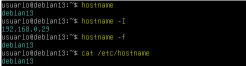
A excepción de hostname -I que es para saber la ip, los demas comandos nos daran el nombre de la máquina.
### Cambiar hostnamme sin reiniciar
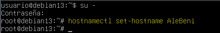
Con el comando hostnamectl set-home xxxx podemos cambiar el nombre del host.
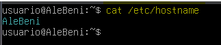
### Versión del sistema
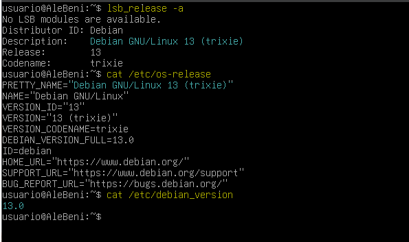
Con estos comandos podremos saber la versión del sistema, siendo lo azul el nombre popular del sistema y entre parentesis su respectivo apodo.
### Memoria RAM
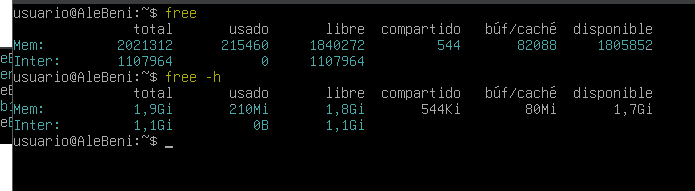
Al usar free nos sale la memoria RAM, siendo mem la memoria física y la Inter (swap) la memoria de intercambio de la ram con el disco duro SSD por si la RAM está saturada.
### CPU
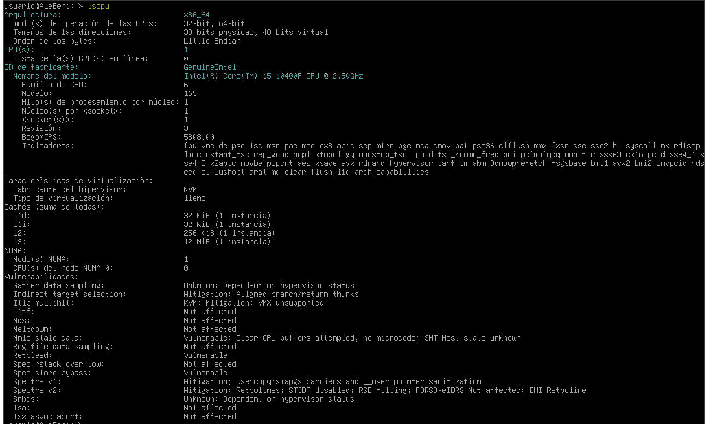
Aqui vemos detalles de la cpu, su arquitectura, el numero de cpus, su fabricante y modelo.
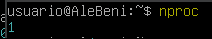
Te dice cuántos procesadores lógicos (o hilos de CPU) están disponibles para el sistema.
### Versión del núcleo y arquitectura
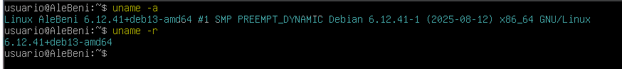
Te dice la versión del núcleo y su arquitectura.
### Discos y particiones

Con este comando podemos ver las particiones del disco duro y su punto de montaje.
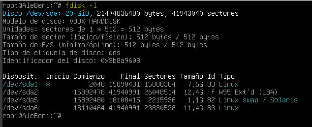
Aqui tambien nos da el formato de cada partición
### Sistemas montados
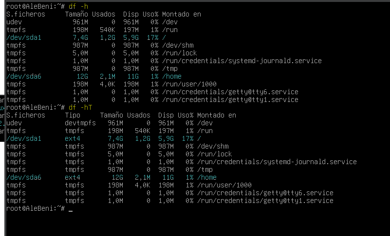
Con estos comandos podemos ver sus puntos de montajes ademas de su uso en %, y el formato.
### Tamaño de una carpeta
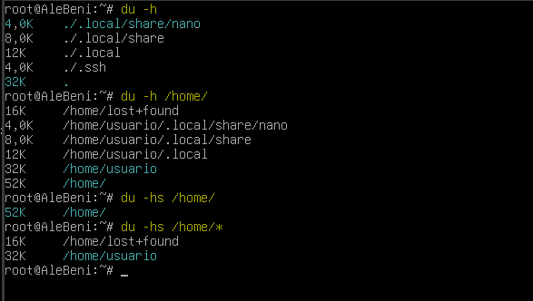
Podemos ver el espacio de los directorios.
### Usuarios y grupos del sistema
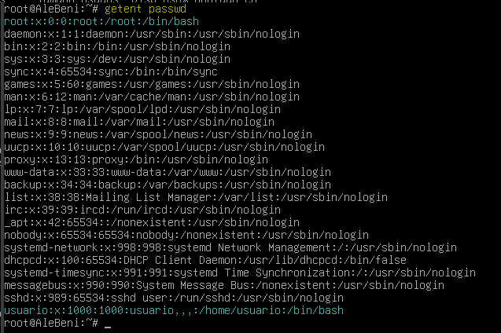
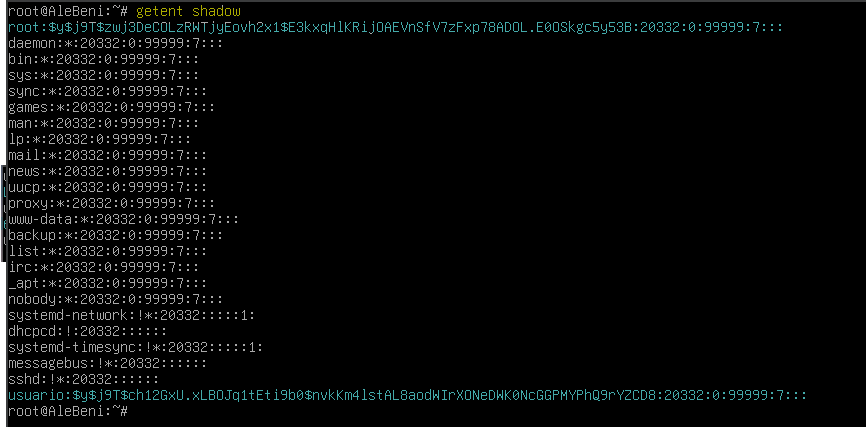

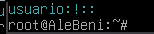
### Información y Configuración de la red
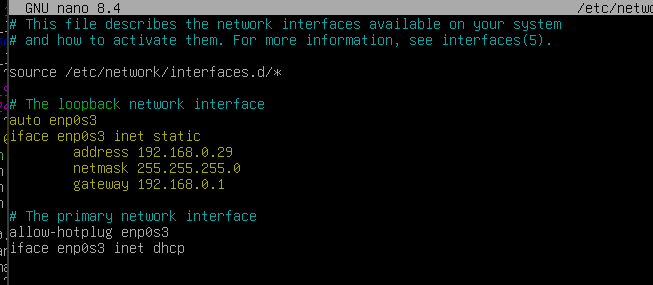
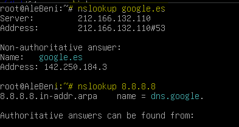
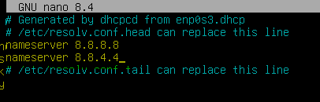
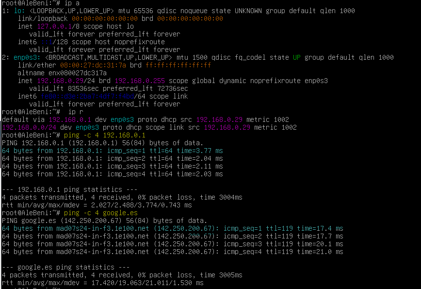

### Reiniciar la red
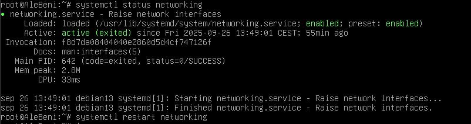
