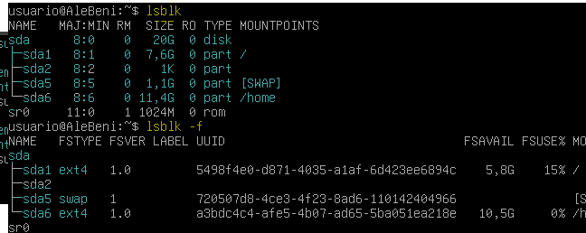

## Conociendo el servidor Linux.

### Nombre del host

### Cambiar hostnamme sin reiniciar

### Versión del sistema

### Memoria RAM

### CPU

### Versión del núcleo y arquitectura

### Discos y particiones

### Sistemas montados

### Tamaño de una carpeta

### Usuarios y grupos del sistema

### Información y Configuración de la red

### Reiniciar la red

