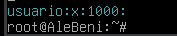

## Conociendo el servidor Linux.
```
En amarillo sale los comandos y en zul los resultados.
```

### Nombre del host


A excepción de hostname -I que es para saber la ip, los demas comandos nos daran el nombre de la máquina.

### Cambiar hostnamme sin reiniciar


Con el comando hostnamectl set-home xxxx podemos cambiar el nombre del host.


### Versión del sistema


Con estos comandos podremos saber la versión del sistema, siendo lo azul el nombre popular del sistema y entre parentesis su respectivo apodo.

### Memoria RAM


Al usar free nos sale la memoria RAM, siendo mem la memoria física y la Inter (swap) la memoria de intercambio de la ram con el disco duro SSD por si la RAM está saturada.

### CPU


Aqui vemos detalles de la cpu, su arquitectura, el numero de cpus, su fabricante y modelo.


Te dice cuántos procesadores lógicos (o hilos de CPU) están disponibles para el sistema.

### Versión del núcleo y arquitectura


Te dice la versión del núcleo y su arquitectura.

### Discos y particiones


Con este comando podemos ver las particiones del disco duro y su punto de montaje.


Aqui tambien nos da el formato de cada partición

### Sistemas montados


Con estos comandos podemos ver sus puntos de montajes ademas de su uso en %, y el formato.
### Tamaño de una carpeta


Podemos ver el espacio de los directorios.

### Usuarios y grupos del sistema





Con estos comandos podemos ver el usuario y grupo al que pertenece, con getent shadow, el segundo campo es su contraseña y esta cifrada.


### Información y Configuración de la red


Aqui hemos configurado una ip estática, con su máscara, y puerta de enlace.


Aqui comprobamos la respuesta de dns y en azul sale el dns que responde.


Aqui configuramos los dns.


Aqui hacemos ping siendo el apartado time, el tiempo de respuesta en milisegundos.

### Reiniciar la red


Con este comando podemos reiniciar la red y cargar nuevas configuraciones.
